# Alexa-Skill-for-Voice-Powered-Analytics

### Introduction
This Alexa skill queries metrics from a data lake. The aim of building this skill is to understand how to uncover Key Performance Indicators (KPIs) from a data set, build and automate queries for measuring those KPIs, and access them via Alexa voice-enabled devices. Startups can make available voice powered analytics to query at any time, and enterprises can deliver these types of solutions to stakeholders so they can have easy access to the Business KPIs that are top of mind.
The main steps of this project include:

* Constructing the Data Lake
* Data Discovery using QuickSight
* Building Data Lake analytics in Athena (based on objects in S3) to generate answers for Alexa
* Building a custom Alexa skill to access the analytics queries from Athena

### Step 0: Lab Setup CloudFormation Stack
I followed the following steps to launch the CloudFormation Stack on the AWS Cloud


### Step 1: Constructing the Data Lake
#### Step 1 a: Generate Twitter Keys
1.  Go to http://twitter.com/oauth_clients/new
2.  Apply for a Twitter Developer Account. Takes ~15 minutes. Requires detailed justification, twitter approval, and email verification
3. Under Name, enter something descriptive, e.g., awstwitterdatalake *can only have alpha-numerics*
4. Enter a description
5. Under Website,  enter the website of your choice
6. Leave Callback URL blank
7. Read and agree to the Twitter Developer Agreement
8. Click "Create your Twitter application"

#### Step 1 b: Deploy App In Repo

1.  Navigate to [Twitter-Poller to-Kinesis-Firehose](https://serverlessrepo.aws.amazon.com/applications/arn:aws:serverlessrepo:us-east-1:381943442500:applications~Twitter-Poller-to-Kinesis-Firehose) in the Serverless Application Repository.
2.  Click the Deploy button (top righthand corner)
3.  Login to your AWS account.  After doing so, scroll down to the Application Settings section where the folloing four values need to be entered:
 i.) The 4 Tokens received from Twitter
 ii.) You can keep the Kinesis Firehose resource name the same or change it to a preferred name 
 iii.) Customize the search text that twitter will bring back
4.  After deploying the Serverless Application, the application will begin polling automatically within the next 5 minutes.

Lastly, note the name of the S3 bucket because it would be required to create the Athena schema.  

### Step 2: AWS QuickSight for Data Visualization
In this step, we will use QuickSight to explore our dataset and visualize a few interesting metrics of the twitter dataset. 

#### Step 2 a: Understand The Raw Data 

This step is intended to give you a better understanding of the data we are using for the lab. 
Each file in S3 has a collection of JSON objects stored within the file.
In addition, the files have been gziped by [Kinesis FIrehose](https://aws.amazon.com/kinesis/firehose/) which saves cost and improves performance.

I have used a dataset created from Twitter data related to AWS re:Invent 2020. 
This dataset includes tweets with the #reinvent hashtag or to/from @awsreinvent. 

#### Getting the data into S3
The data is acquired starting with a CloudWatch Event triggering an AWS Lambda function every 5 minutes. Lambda is making calls to Twitter's APIs for data, and then ingesting the data into [Kinesis Firehose](https://aws.amazon.com/kinesis/firehose/).   
Firehose then micro-batches the results into S3 as shown in the following diagram:


This dataset has been acquired from the following bucket:
EU-WEST-1 | ```s3://aws-vpa-tweets-euw1/```


Amazon Kinesis Firehose delivers the data into S3 as a GZIP file format.
A variety of methods can be used to download one of the files in the dataset. If you use the AWS CLI today, this is likely the easiest method to take a look at the data.

List one of the files with (Note use **s3://aws-vpa-tweets-euw1...** for Ireland):
```bash
aws s3 ls s3://aws-vpa-tweets/tweets/sample/2017/11/06/04/aws-vpa-tweets-sample.gz
```
Download this file to your local directory (Note use **s3://aws-vpa-tweets-euw1...** for Ireland):
```bash
aws s3 cp s3://aws-vpa-tweets/tweets/sample/2017/11/06/04/aws-vpa-tweets-sample.gz .
```

Since the files are compressed, you will need to unzip it. In addition the data is stored in raw text form. Make sure you rename the file to either *.json or *.text.
The data format look like this:
```json
{  
    "id": 914642318044655600,  
    "text": "Two months until #reInvent! Check out the session calendar & prepare for reserved seating on Oct. 19! http://amzn.to/2fxlVg7  ",  
    "created": "2017-10-02 00:04:56",  
    "screen_name": " AWSReinvent ",  
    "screen_name_followers_count": 49864,  
    "place": "none",  
    "country": "none",  
    "retweet_count": 7,  
    "favorite_count": 21
}
```

#### Step 2b: Create an Athena Table

We need to create a table in Amazon Athena. This will allow us to query the data at rest in S3 from QuickSight. 
The twitter data is stored as JSON documents and then compressed in s3. 
Athena supports reading of gzip files and includes json SerDe's to make parsing the data easy.

**Create Athena table**

1. We need to ensure that we are in the **same region** that launched the CloudFormation stack 
2. For the **Ireland region**, modify the location field below with the following location:
LOCATION
  's3://aws-vpa-tweets-euw1/tweets/'
  3. In the AWS account navigate to the **Athena** service
  4. In the top left menu, choose *Query Editor*
  5. Use this code to create the Athena table. Once added, click **Run Query**

```SQL
CREATE EXTERNAL TABLE IF NOT EXISTS default.tweets(
  id bigint COMMENT 'Tweet ID', 
  text string COMMENT 'Tweet text', 
  created timestamp COMMENT 'Tweet create timestamp', 
  screen_name string COMMENT 'Tweet screen_name',
  screen_name_followers_count int COMMENT 'Tweet screen_name follower count',
  place string COMMENT 'Location full name',
  country string COMMENT 'Location country',
  retweet_count int COMMENT 'Retweet count', 
  favorite_count int COMMENT 'Favorite count')
ROW FORMAT SERDE 
  'org.openx.data.jsonserde.JsonSerDe' 
WITH SERDEPROPERTIES ( 
  'paths'='id,text,created,screen_name,screen_name_followers_count,place_fullname,country,retweet_count,favorite_count') 
STORED AS INPUTFORMAT 
  'org.apache.hadoop.mapred.TextInputFormat' 
OUTPUTFORMAT 
  'org.apache.hadoop.hive.ql.io.HiveIgnoreKeyTextOutputFormat'
LOCATION
  's3://aws-vpa-tweets/tweets/'
```

**Verify the table created correctly** 
1. We will see an Athena table called *tweets* in the *default* database 
2. If we click on the *tweets* table, we can see the fields that we saw earlier.    
3. Let's test that the tweets table works.  In the same Query Editor run the following `SELECT` statement (clear the previous statement):

```SQL
SELECT COUNT(*) AS TOTAL_TWEETS FROM tweets;
```


#### Step 2 c: Explore the data using Quicksight
We've created an Athena table directly on top of our S3 Twitter data, let's explore some insights on the data.  
While this can be achieved through Athena itself or compatible query engines, Amazon Quicksight enables us to connect directly to Athena and quickly visualize it into charts and graphs without writing any SQL code.  
Let's explore:      

**Import Permissions note** 
1. Launch the [QuickSight portal](https://us-east-1.quicksight.aws.amazon.com/).  This may ask you to register your email address for Quicksight access.  
2. If not already configured, Quicksight may need special permissions to access Athena:   
a. (These settings can only be changed in the **N.Virginia region**) In the upper right corner, ensure **US East N. Virginia** is selected, then to the right of the *region* in the upper right corner, choose the profile name, and from the dropdown menu, choose *Manage Quicksight*.    
b. On the left menu, click *Account Settings*  
c. Click the *Edit AWS permissions* button  
d. Ensure the box *Amazon Athena* is checked.  
e. Click *Choose S3 Buckets*, **Choose Select All**.   
f. Click the Tab *S3 Buckets you can access across AWS*, under *Use Different Bucket*, Type: ```aws-vpa-tweets``` (Note For Ireland: ```aws-vpa-tweets-euw1```) Then click **Add S3 Bucket**, then click **Select Buckets**, then click **Apply**    


 

1. **(if running out of Ireland)** In the main Quicksight portal page, switch back to the **EU Ireland Region**)
2. In the upper right choose **Manage data**
3. Now in the upper left choose **New data set**
4. We see tiles for each of the QuickSight supported data sources. From this page select the **Athena** tile. 
5. When asked for the dataset name we can choose anything you like, for our example I used **tweets-dataset**.We can choose to validate that SSL will be used for data between Athena and QuickSight. Finish by selecting **Create data source**
6. Now we need to choose the Athena table we created in **Step 1**. For our example we used the **Default** database, with a table name of **tweets**. Finish by clicking on **Select**. 
7. SPICE is not needed for this project. If asked, select **Directly query your data**. Click Visualize when done. 
8. QuickSight will now import the data. Wait until we see **Import Complete**. Then close the summary window. 
9. Add the **created** field from the Athena table by dragging it from the Field list to the empty AutoGraph window.
10. From the *Visual types* in the bottom left corner, select **Vertical bar chart**
11. Add another Visual by selecting in the top left corner, the **+ Add** button and then **Add visual**
12. On this new graph, lets add the **country** field. 
13. As we can see, lots of tweets do not include which country the tweet was created in. Let’s filter these results out. Click on the large bar labeled **none**, then select **exclude "none"** from the pop up window. Now we can see the tweets without a location were excluded.
14. Lets change the visual from a bar chart to a pie chart. Select the entire visual, then from the bottom right select the **pie chart** visual.  Add **Group By: "country"**

** Interesting insights from the data in QuickSight**

 
 
 
 


### Step 3: AWS Athena Configuration

In this step, we configure Athena and Lambda to create a solution to query data at rest in S3 and build answers for Alexa. 

#### Step 3 a: Double check to ensure that we are running in the same region that the CloudFormation was launched

In this step, we will use Athena and Lambda. It is important to ensure that we are still using the same region launched with the CloudFormation


#### Step 3 b: Create a query to find the number of reinvent tweets 

We need to produce an integer for our Alexa skill. To do that, we need to create a query that will return our desired count.

1. To find the last set of queries from Quicksight, go to the Athena AWS Console page, then select **History** on the top menu.
2. We can see the latest queries under the column **Query** (starting with the word 'SELECT').  
3. We'll be running these queries in the **Query Editor**. Navigate there in the top Athena menu.  
4. Ensure that the **default** database is selected and we'll see your **tweets** table.  
5. The Athena syntax is widely compatible with Presto. 
6. Once happy with the value returned by the query, we can move to **Step 3**, otherwise we can experiment with other query types. 
7. Let's write a new query. Hint: The Query text to find the number of #reinvent tweets is:  `SELECT COUNT(*) FROM tweets`

```SQL
--Total number of tweets
SELECT COUNT(*) FROM tweets

--Total number of tweets in last 3 hours
SELECT COUNT(*) FROM tweets WHERE created > now() - interval '3' hour

--Total number of tweets by user chadneal
SELECT COUNT(*) FROM tweets WHERE screen_name LIKE '%chadneal%'

--Total number of tweets that mention AWSreInvent
SELECT COUNT(*) FROM tweets WHERE text LIKE '%AWSreInvent%'

-- Submitted by Patrick (@imapokesfan) 11/29/17:
SELECT screen_name as tweeters,text as the_tweet
from default.tweets
where text like '#imwithslalom%'
group by screen_name, text

-- Submitted by Cameron Pope (@theaboutbox) 11/29/17:
SELECT count(*) from tweets where text like '%excited%'


#### Step 3 b: Create a lambda to query Athena

In this step, we will create a **Lambda function** that runs every 5 minutes. The lambda code is provided but please take the time to review the function.

1. Go to the [AWS Lambda console page](https://console.aws.amazon.com/lambda/home?region=us-east-1#/functions)
2. Click **Create Function** 
3. We will skip using a blueprint to get started and author one from scratch. Click **Author one from scratch** 
4. Under name add **vpa_lambda_athena_poller**
5. For Runtime, select **Python 3.6**
6. Under Role leave the default value of **Choose an existing role**
7. Under existing role, select **VPALambdaAthenaPollerRole**
8. Click **Create Function** 


#### Function Code

1. For Handler, ensure that it is set to: **lambda_function.lambda_handler**
2. Select inline code and then use the code below

```Python
import boto3
import csv
import time
import os
import logging
from urllib.parse import urlparse

# Setup logger
logger = logging.getLogger()
logger.setLevel(logging.INFO)


# These ENV are expected to be defined on the lambda itself:
# vpa_athena_database, vpa_ddb_table, vpa_metric_name, vpa_athena_query, region, vpa_s3_output_location

# Responds to lambda event trigger
def lambda_handler(event, context):
    vpa_athena_query = os.environ['vpa_athena_query']
    athena_result = run_athena_query(vpa_athena_query, os.environ['vpa_athena_database'],
                                     os.environ['vpa_s3_output_location'])
    upsert_into_DDB(str.upper(os.environ['vpa_metric_name']), athena_result, context)
    logger.info("{0} reinvent tweets so far!".format(athena_result))
    return {'message': "{0} reinvent tweets so far!".format(athena_result)}


# Runs athena query, open results file at specific s3 location and returns result
def run_athena_query(query, database, s3_output_location):
    athena_client = boto3.client('athena', region_name=os.environ['region'])
    s3_client = boto3.client('s3', region_name=os.environ['region'])
    queryrunning = 0

    # Kickoff the Athena query
    response = athena_client.start_query_execution(
        QueryString=query,
        QueryExecutionContext={
            'Database': database
        },
        ResultConfiguration={
            'OutputLocation': s3_output_location
        }
    )

    # Log the query execution id
    logger.info('Execution ID: ' + response['QueryExecutionId'])

    # wait for query to finish.
    while queryrunning == 0:
        time.sleep(2)
        status = athena_client.get_query_execution(QueryExecutionId=response['QueryExecutionId'])
        results_file = status["QueryExecution"]["ResultConfiguration"]["OutputLocation"]
        if status["QueryExecution"]["Status"]["State"] != "RUNNING":
            queryrunning = 1

    # parse the s3 URL and find the bucket name and key name
    s3url = urlparse(results_file)
    s3_bucket = s3url.netloc
    s3_key = s3url.path

    # download the result from s3
    s3_client.download_file(s3_bucket, s3_key[1:], "/tmp/results.csv")

    # Parse file and update the data to DynamoDB
    # This example will only have one record per petric so always grabbing 0
    metric_value = 0
    with open("/tmp/results.csv", newline='') as f:
        reader = csv.DictReader(f)
        for row in reader:
            metric_value = row['_col0']

    os.remove("/tmp/results.csv")
    return metric_value


# Save result to DDB for fast access from Alexa/Lambda
def upsert_into_DDB(nm, value, context):
    region = os.environ['region']
    dynamodb = boto3.resource('dynamodb', region_name=region)
    table = dynamodb.Table(os.environ['vpa_ddb_table'])
    try:
        response = table.put_item(
            Item={
                'metric': nm,
                'value': value
            }
        )
        return 0
    except Exception:
        logger.error("ERROR: Failed to write metric to DDB")
        return 1

```


#### Environment variables

You will need the S3 bucket name you selected from the CloudFormation template. 
If you forgot the name of your bucket you can locate the name on the output tab of the CloudFormation stack.


1. Set the following Environment variables:

```
vpa_athena_database = tweets
vpa_ddb_table = VPA_Metrics_Table
vpa_metric_name = Reinvent Twitter Sentiment
vpa_athena_query = SELECT count(*) FROM default."tweets"
region = eu-west-1 (if running out of Ireland) or us-east-1 (if running out of Northern Virginia)
vpa_s3_output_location = s3://<your_s3_bucket_name>/poller/
```


#### Basic Settings

1. Set the timeout to 2 min

### Triggers Pane

We will use a CloudWatch Event Rule created from the CloudFormation template to trigger this Lambda. 
Scroll up to the top of the screen, select the pane **Triggers**. 

1. Under the **Add trigger**, click the empty box icon, followed by **CloudWatch Events**
2. Scroll down, and under *Rule*, select **VPAEvery5Min**
3. Leave the box checked for **Enable trigger**
4. Click the **Add** button, then scroll up and click **Save** (the Lambda function)


#### Step 3 c: Create a test event and test the Lambda

At this point we are ready to test the Lambda. Before doing that we have to create a test event. 
Lambda provides many test events, and provides for the ability to create our own event. 
In this case, we will use the standard CloudWatch Event.

#### To create the test event

1. In the upper right, next to test, select **Configure test events**
2. Select **Create new test event**
3. Select **Select Amazon CloudWatch** for the event template
4. Use **VPASampleEvent** for the event name
5. Click **Create** in the bottom right of the window


#### Now we should test the Lambda. 

1. Click **test** in the upper right
1. Once the run has completed, click on the **Details** link to see how many reinvent tweets are stored in s3.

Note, there should be > 10,000 tweets. 


### Step 4: Alexa Skill Building

In this step, we will build a voice powered analytic engine that can take deliver valuable company insights.   Common questions that may be asked, “Alexa, how many Unique Users did our site have last month?” and “Alexa, how many orders have breached their delivery SLA this week?”.

The following dependencies are needed in order to successfully complete this step.

- [ ] Successful completion of Athena Query Building Section
- [ ] [Amazon Developer account](http://developer.amazon.com/) (free)

### Step 4 a: Setting up the Voice User Interface
There are two parts to an Alexa skill. The first part is the Voice User Interface (VUI). This is where we define how we will handle a user's voice input, and which code should be executed when specific commands are uttered. The second part is the actual programming logic for our skill.   Both will be configured in this step-by-step guide.


Alexa fits into your Voice Powered Analytics architecture as the interaction interface for retrieving metrics.  Alexa determines what metrics to retrieve through intents. The intents correspond to metrics in the DynamoDB data store, which Lambda functions retrieve and send back to the Alexa-enabled device to communicate back to the user:
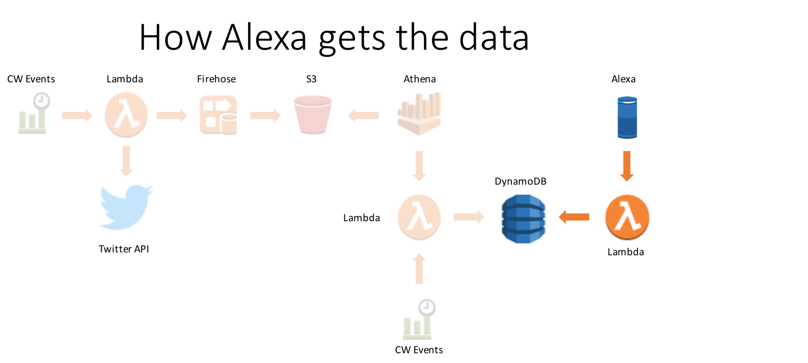

1.    Go to the [Amazon Developer Portal](http://developer.amazon.com/)
2.    Click the **Alexa button** on the left portion of the screen.

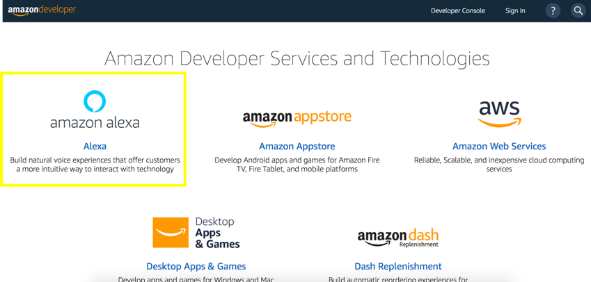

3.    In the top-right corner of the screen, **click the Sign In button**. (If you don't already have an account, create a new one for free.)
4.    Once you have signed in, on the Alexa page, **click the Alexa Skills Kit button**, which is what we'll use to create our custom skill.

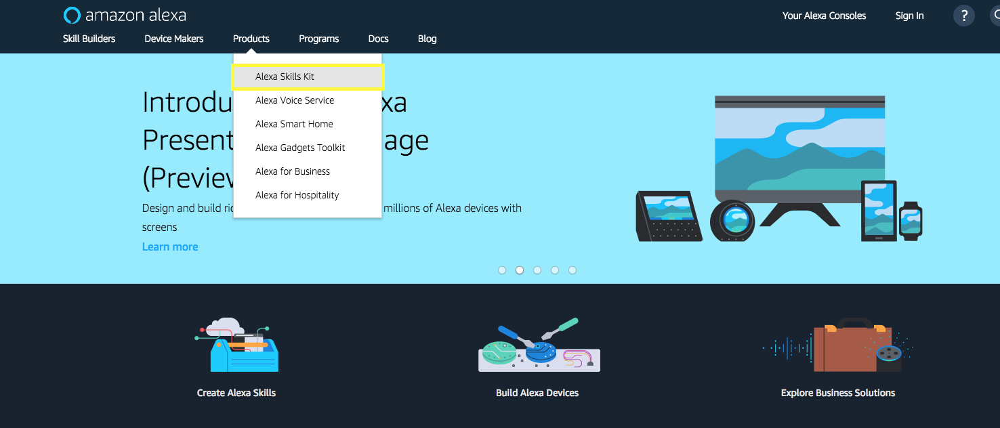

5.    Next **Click on Start a Skill Button**


6.    Click on Create Skill button to start creating a custom skill.

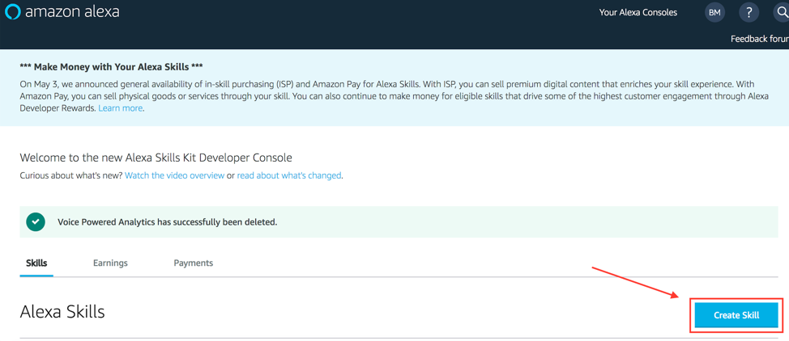

7.    Type in the **Skill name** *Voice Powered Analytics*, Select the **Custom** button and finally click the **Create Skill** button:

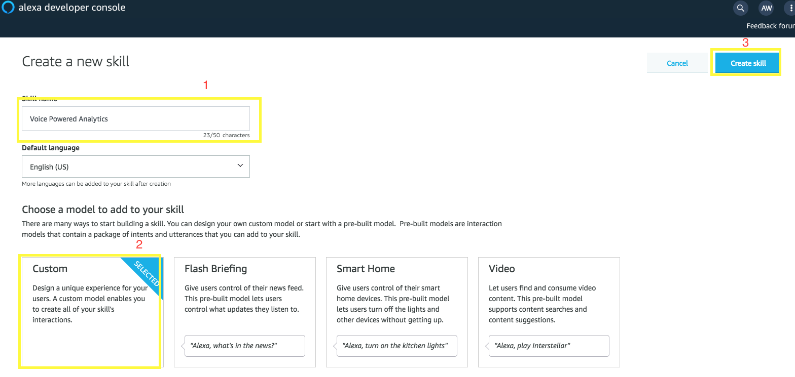


8.    Select the option **Start From Scratch**,then select the **Choose** button in the top righthand corner:


9.    Next, **Click on 1. Invocation Name >**


10.    Ensure the skill invocation name is entered (if not, type:) **voice powered analytics*** (all lower case)

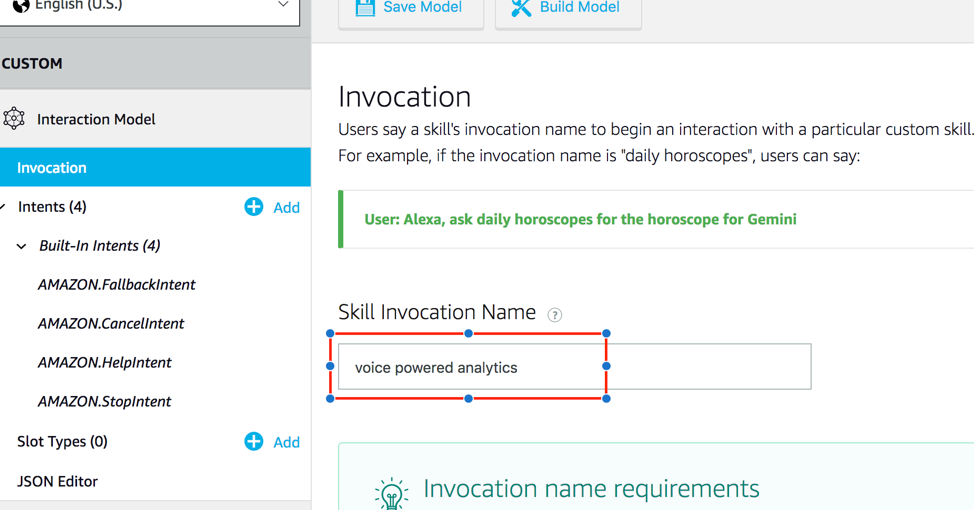

11.    **Click on + Add button** next to Intent.

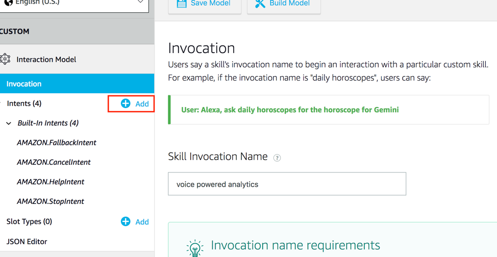

12.    **Type the custom intent name** *WhatsMyMetric* and **click Create Custom Intent button**


13.    Next we're going Add utterances to our intent. This triggers an invoke of your intent through your user's voice. You'll want to add a few different variations based upon how users will interact with the different types of metrics available to query.
- **Type the *What’s my {metric}*** (ignore the popup box) and **Click + sign** to add the utterance.


14.    Now we'll configure our slots. Slots allow you to parameterize different variable attributes when invoking your intent. For this workshop, the slot will be our metric(s) that we've created with the Athena query. This is why we've put the {metric} slot name in our utterances.
- **Click on + Add** on the left menu, next to Slot.

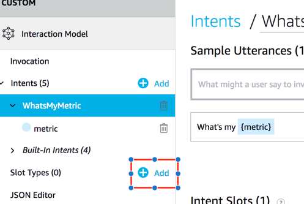

- **Type *available_metrics*** and **click Create custom slot type**

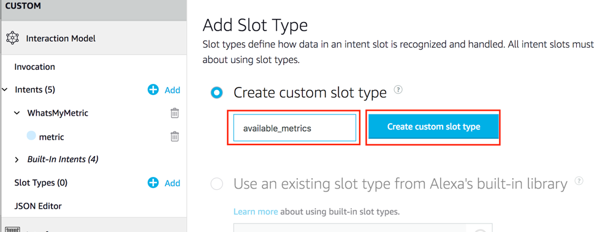

- For the slot value, **enter the value of the metric** used from the *Athena_Poller* Lambda function's environment variable: metric (e.g. *reinvent twitter sentiment*. Then **click the + button**. Note: The DynamoDB item that is used as our key in the backend lambda function uses this value to query our metric's value.

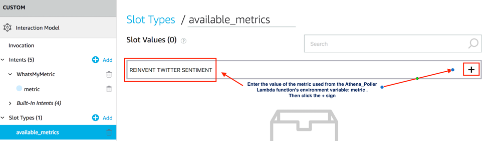

15.    **Click on *WhatsMyMetric*** on the left menu under Intents. Then **select *available_metrics*** in the dropdown menu next to metric.


16.    Now **click on Build Model**. This will save your model and build it.

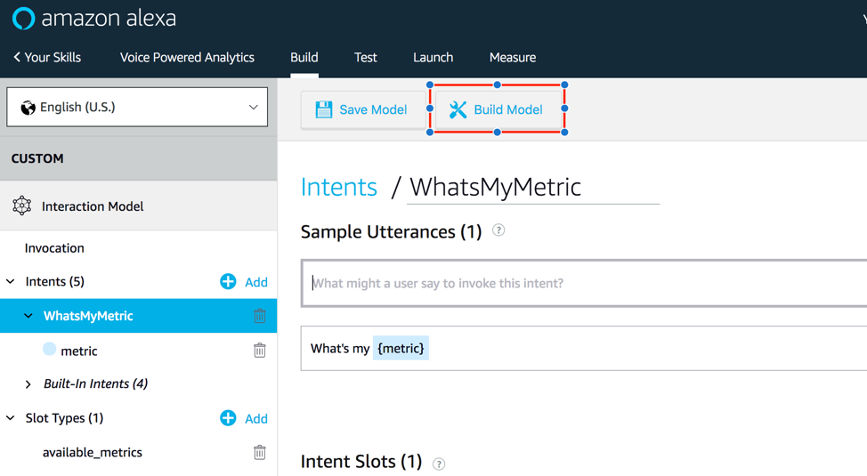

- You should see: 
- It may take a minute or two to build, if your interaction model builds successfully you'll see a successful build message added to the dialog: 

**Troubleshooting** If you get an error from your interaction model, check through this list:
   - Did you copy & paste the provided code into the appropriate boxes?
   - Did you accidentally add any characters to the Interaction Model or Sample Utterances?

In our next step of this guide (Configure Alexa Backend), we will be linking a Lambda function in the AWS developer console.
</details>

#### Step 4 b: Configure Alexa Backend
Now that we've configured the voice interaction, let's set up your Lambda function to be triggered by your Alexa Skills Kit and leverage your DynamoDB metrics.
Note: When you ran the initial setup CloudFormation in Module 1, a Lambda function with the name starting with **::Stack Name::-AlexaMetricSkill** was deployed.
<details>
<summary><strong>Full solution - Setting up Alexa Backend (expand for details)</strong></summary>

1. Check your **AWS region** as the Lambda function needs to be in the same region that your previous resources created in Module 2 were created.

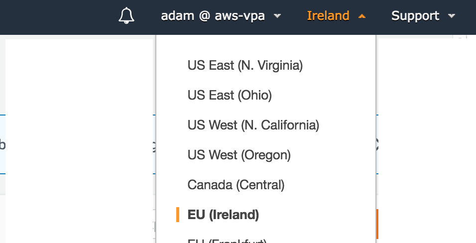

2. **Open the Lambda function, starting with ::Stack Name::-AlexaMetricSkill** that was deployed with the Setup Cloudformation.
  Then we'll **Configure your trigger**: Under Configuration, and in **Add Triggers** pane, **select Alexa Skills Kit** from the list. It will then add this trigger to your Lambda function.

  2a.  **Scroll down to Configure Triggers**, **click  Skill ID verification disable**.   Note: optionally you can use the Alexa SkillID to lock down the lambda function to your specific Alexa Skill; this is a best practice.  Next, click the **Add** button, then scroll to the top of the Lambda function and click **Save**

  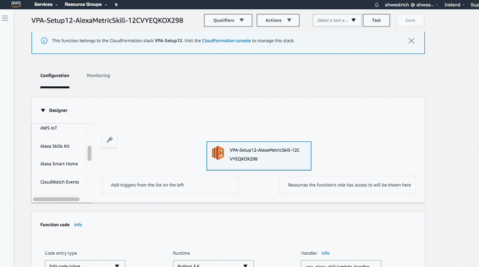

3. **Copy your Lambda function's ARN value to a separate text editor** The *ARN value* is in the top right corner.  We'll use this in the next section of the guide.

  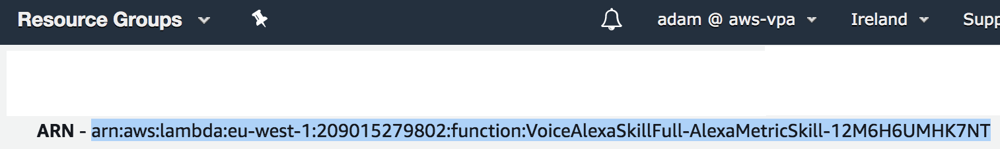

  4. Next, **click the Configuration Tab**, then click on the Lambda function icon and name button **.starting with ::Stack Name::-AlexaMetricSkill**  to go back to your code.
  
   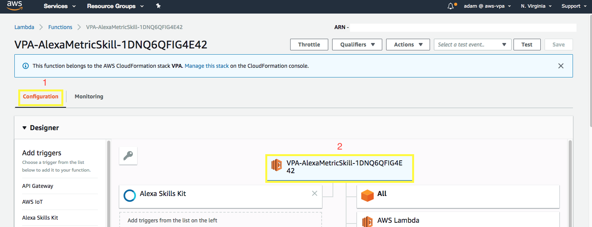
   
  5.  Scroll down beneath the code and navigate to **Environment Variables**.
  6. **Validate/or change the environment variables**:
    - **intent_name** matches what's configured for your *intent* in the Alexa Skill's Interaction Configuration
    - **slot_name** matches what's configured for your *slot name* in the Alexa Skill's Interaction Configuration
    - (Optional) You can modify the greeting and exit message for your Alexa skill by changing the value of two environment variables: **greeting_msg** and **exit_msg**
  <details>
<summary>Example</summary>

  greeting_msg *Welcome to the Voice Powered Analytics.  Please tell me what metrics you'd like to hear. To hear available metrics, ask Alexa tell me my metrics*
  and
  exit_msg *Thank you for trying the Voice Powered Analytics.  Have a nice day!*
</details>
-  There's also an environment variable called: metrics_table with the value VPA_Metrics_Table.  This references the DynamoDB table that the Alexa skill will be querying for your metric
<details><summary>Hint</summary>

  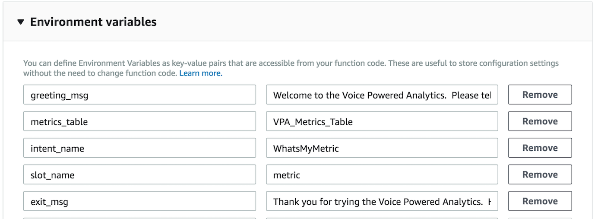
</details>


  7. **Bonus (Time permitting)**: can you add a skill to the Lambda function which enables users to "List My Metrics"
</details>

#### Step 4 c: Connecting Your Voice User Interface to Your Lambda Function

In Step 4a "Setting up Your Voice User Interface", we created a voice user interface for the intents and utterances we expect from our users.

On "Step 4b Configure Alexa Backend", we created a Lambda function that contains all of our logic for the skill.
In this step, we need to connect those two pieces together.

1.    **Go back to the [Amazon Developer Portal](http://developer.amazon.com/)** and **select your skill (*Voice Powered Analytics*)** from the list. You may still have a browser tab open if you started at the beginning of this tutorial.
2.    **Click on Endpoint** on the left menu. Then **Select the AWS Lambda ARN**.


3.    **Paste the ARN** you copied in number 3 of Step 2 to Default Region.

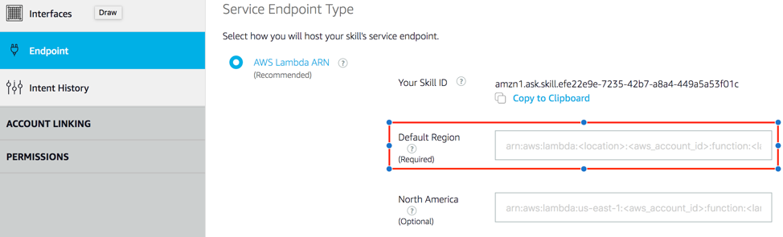

4.    Click **Save Endpoints**


5.    Congratulations: You are all set to test your skill.
</details>

#### Step 4 d: Testing Your Alexa Skill
We've now created a Voice User Interface and a Lambda function, and connected the two together. The skill is now ready to test.

1.    In the [Amazon Developer Portal](http://developer.amazon.com/), **select your skill (e.g. *Voice Powered Analytics*)** from the list. You may still have a browser tab open if you started at the beginning of this tutorial.
2.    **Click on "Test"** tab on the top.


3.    Enable testing for the skill by clicking slider button


4.    Once enabled, type *“ask Voice Powered Analytics”* and **click the Mic button**

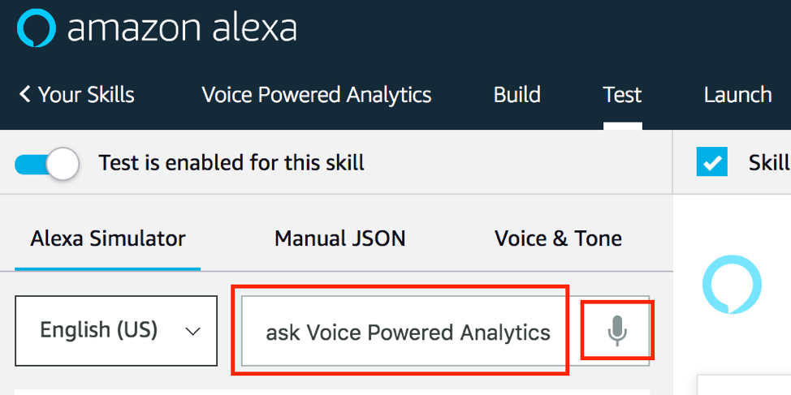

Note: You should see the results on the right window


5.    We can have an entire conversation with your skill with the Service Simulator. Try the following commands:
- *"what is my reinvent twitter sentiment"*

 - Click the **Listen** button in the bottom right corner to hear Alexa read the response.
 - We can have an entire conversation with your skill with the Service Simulator. Try the following commands:
 - "ask Voice Powered Analytics" then "what is my reinvent twitter sentiment"

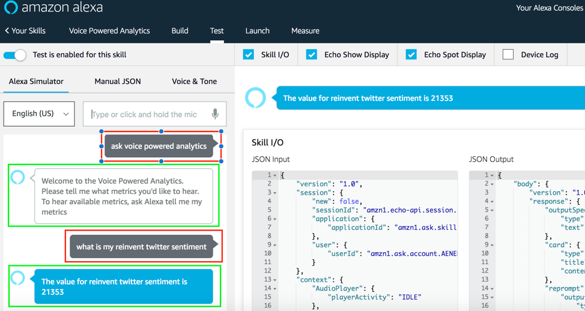

6.  (Optional) Other testing methods to consider:
- [Echosim.io](https://echosim.io/) - a browser-based Alexa skill testing tool that makes it easy to test your skills without carrying a physical device everywhere you go.
- [Unit Testing with Alexa](https://github.com/alexa/alexa-cookbook/blob/master/guides/testing/postman.md) - a modern approach to unit testing your Alexa skills with [Postman](http://getpostman.com/) and [Amazon API Gateway](http://aws.amazon.com/apigateway).

Note: If your sample skill is working properly, you can now customize your skill.

 #### Troubleshooting
 - If you receive a response that reads: *"The remote endpoint could not be called, or the response it returned was invalid,"* this is an indication that something is broken. Copy the JSON from the Alexa skill and insert it as a test event to our Lambda function **VoiceAlexaSkillFull-AlexaMetricSkill-1**.  You can then see the specific output from the Lambda function as to why it is not executing successfully.
 - It is most likely due to either the Alexa Skills Kit: **slot name** or **intent name** does not match the Lambda environment variables.
- Also make sure that the DynamoDB has an entry with a value for your metric.

#### (Optional) Step 4 e: Deploy to Alexa For Business
To make the skill private for your organization.  You can optionally follow the following steps to deploy: [Alexa For Business](https://github.com/awslabs/voice-powered-analytics/blob/master/README-A4B.md)

   Intent: ListMetrics
   Utterance(s):
   - ListMetrics List My Metrics
   - ListMetrics What are my metrics


